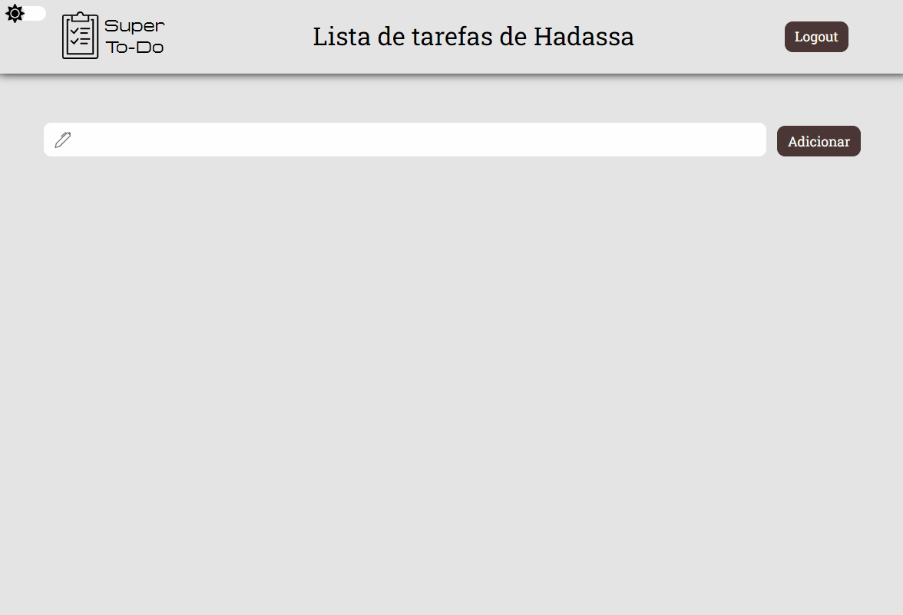

 <h1 align="center">A To-do list application with authentication.</h1>

# 
In Development ⚙️

  
  
  

---

## 🚀 Technologies

⚙️ Main technologies that this project was developed:

- ✔️ReactJS

- ✔️NodeJS

- ✔️MongoDB

- ✔️Typescript

- ✔️Express

- ✔️Styled-Components

- ✔️JWT-token

- ✔️BcryptJs

- ✔️React Router

- ✔️Eslint

- ✔️Prettier

#

Made with 💙 by Isaac Willian 👋 [See my linkedin](https://www.linkedin.com/in/isaaacwillian/)
